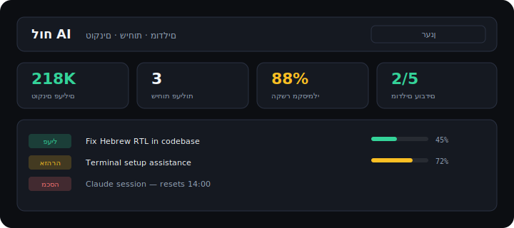

# AI Terminals · מודלים טרמנילים

<p align="center">
  <strong>One clean dashboard for all your terminal AI tools on Windows</strong><br>
  <sub>טוקנים · סטטוס שיחות · Grok · Claude · Gemini · Codex · DeepSeek</sub>
</p>

---

## Why this exists

Running 5+ AI CLIs on Windows gets messy fast — scattered shortcuts, no idea which chat ate your context, limits hit at the worst time.

**AI Terminals** gives you:

| Feature | What you get |
|---------|----------------|
| **Dashboard** | Token usage, context %, conversation status |
| **2 desktop shortcuts** | `AI Hub` menu + `AI Dashboard` |
| **Health check** | Which models work right now |
| **Free fallbacks** | Gemini / Groq / Ollama when paid limits hit |

## Quick start (2 minutes)

```bat
setup-desktop.bat    rem clean desktop + 2 shortcuts
setup-keys.bat       rem optional: free Gemini key
check-all.bat        rem refresh dashboard
```

Then double-click **AI Dashboard** on your desktop.

## Desktop after setup

Only **two** shortcuts — no clutter:

| Shortcut | Opens |
|----------|--------|
| `AI Hub.lnk` | Interactive menu — launch any model |
| `AI Dashboard.lnk` | Token & conversation dashboard |

Project folder: `Desktop\AI-Terminals` (junction to this repo)

## Dashboard



Shows:

- **Active tokens** across open Grok sessions
- **Per-conversation status** — active / warning / closed / error
- **Context bar** — how full each chat is (%)
- **Model pills** — Grok, Claude, Gemini… at a glance

Refresh:

| Script | Speed |
|--------|-------|
| `refresh-conversations.bat` | Fast — conversations only |
| `check-all.bat` | Full — models + conversations |

## Requirements

- Windows 10/11
- PowerShell 5.1+
- Optional CLIs: `grok`, `claude`, `gemini`, `codex`

## Configuration

```powershell
copy ai-secrets.example.ps1 ai-secrets.ps1
# Edit API keys — never commit ai-secrets.ps1
```

## Project layout

```
AI-Terminals/
├── start.bat              # Hub menu (AI Hub shortcut)
├── open-dashboard.bat     # Dashboard (AI Dashboard shortcut)
├── check-all.bat          # Full status refresh
├── refresh-conversations.bat
├── setup-desktop.bat      # Clean desktop
├── setup-keys.bat
├── hub.ps1                # Hebrew interactive menu
├── dashboard-template.html
├── _conversations.ps1     # Grok / Claude / Cursor scanner
├── _status.ps1            # Model health checks
└── launch-*.ps1           # Per-model launchers
```

## Publish to GitHub

```bat
publish-github.bat
```

Or manually:

```bash
gh repo create DavidPatlas-AI/ai-terminals --public --source=. --push
```

## License

MIT — David Patlas

---

## בעברית

### 3 שמות, פרויקט אחד

| שם | מה זה |
|----|--------|
| `מודלים טרמנילים` | התיקייה האמיתית על שולחן העבודה |
| `AI-Terminals` | **אותה תיקייה** (junction — שם אנגלי) |
| `AI Hub.lnk` | קיצור שפותח `start.bat` → תפריט מודלים |

אין 3 פרויקטים. קרא `MAP.txt` לתרשים מלא.

### שולחן עבודה (2 קיצורים בלבד)

- **AI Hub** — תפריט מודלים
- **AI Dashboard** — טוקנים ושיחות

`START-HERE.bat` = נקודת כניסה אחת לכל הפעולות.

### פרסום ל-GitHub (ציבורי)

```bat
security-check.bat    rem חובה — בודק שאין מפתחות
publish-github.bat    rem דוחף ל-GitHub
```

**כתובת:** https://github.com/DavidPatlas-AI/ai-terminals

**לעולם לא נדחף:** `ai-secrets.ps1`, מפתחות API, `status.json`

**תיקיות ישנות (לא בשימוש):** `Desktop\כלים\AI-Chats`, `Desktop\כלים\צאטים`